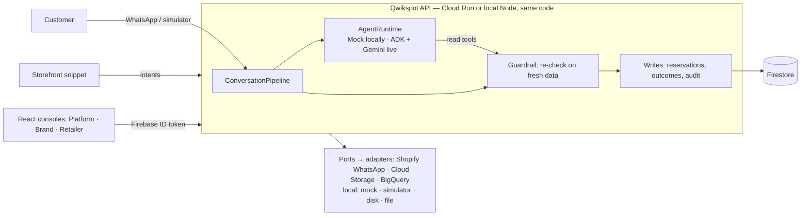

# Qwikspot

**AI that turns a shopper's "I need it today" into a sale at the nearest store that really has it — and shows the brand what happened.**

Qwikspot is an omnichannel commerce layer for D2C brands. It watches storefront intent (a product view, an abandoned cart, a "Need it today?" tap), continues the journey in a WhatsApp conversation, lets an AI agent pick the next best action from **verified** catalogue and store-stock data, reserves the product at an eligible nearby store, guides the store through the pickup, and records the outcome — online or in store — so the brand can see whether a weekday problem is demand or availability.

Every AI action is re-checked by a guardrail on fresh data before anything is written; the agent can never invent stock, choose a closed store or touch another customer's data.

## Try it in 10 minutes (local, synthetic data)

Requires **Node.js 24** and **Java 21+** (Firebase emulators). No Google Cloud account and no `.env` files.

```bash
npm install
cp backend/.env.example backend/.env   # turns on DEMO_MODE: demo logins on the login page + Reset demo
npm run emulators            # terminal 1: Auth + Firestore emulators
npm run seed:demo            # terminal 2: demo brand, stores, stock, users, 4 weeks of synthetic history
npm run dev:backend          # terminal 2: API on :8080
npm run dev:frontend         # terminal 3: http://localhost:5173
```

Open <http://localhost:5173/login>: every demo account is one **Use** click away under **Try the demo**. Each browser tab keeps its own sign-in, so one window can hold all four roles. (DEMO_MODE is off unless configured; it never widens what a role may do.)

| Account | Role | What to look at |
|---|---|---|
| Brand Admin — Demo Beauty Co | `admin@demo-brand.test` | Demo guide, simulator, decision trace, Outcomes & insights |
| Retail Admin — Bandra Store | `retail-admin-north-1@qwikspot.test` | Bandra's reservation queue and stock only |
| Retail Admin — Andheri Store | `retail-admin-north-2@qwikspot.test` | Andheri's queue — the demo hold lands here |
| Platform Admin | `platform@qwikspot.test` | Brands, onboarding checklist, last activity, suspend — never customer data |

Local demo password: `qwikspot-demo-1` (emulators only; a deployed demo uses its own secret).

### The 4-tab walkthrough

| Tab | Steps |
|---|---|
| **1 · Brand Admin** (`/brand`) | Open the **Demo guide**. Step 1 opens the demo store. |
| **2 · Demo store → simulator** | Pick **Vitamin C Glow Serum 30 ml** → **Need it today? Check a store near you**. The simulator opens in a new tab (sign in as the Brand Admin there) with the message ready — send it. **Share location → Near Powai → Send location**. Powai has no stock, so the assistant offers **Hold 1 at Andheri** — tap it: pickup code, hold-until time, maps link. Under the chat, **Why Qwikspot did this** shows eligible and excluded stores with reasons, the guardrail's fresh re-check and every tool call. |
| **3 · Retail Admin — Andheri** | The hold is at the top of **Reservations**: **Confirm → Mark ready → Customer arrived → Complete** with the customer's 6-digit code (shown in tab 2). The customer gets a message at each step; stock drops by one. Try **Refuse → Not actually in stock** on another hold: the customer is offered the next store that really has it. |
| **4 · Outcomes & insights** (tab 1 → nav) | The pickup is an **in-store** outcome. The weekday panel explains, from counted records, that Saturday is an *availability* problem, not a demand problem, with suggested next actions. Then sign in as the **Platform Admin** in this tab: brands with their onboarding checklist and last activity. |

Done? **Reset demo** in the Brand Admin's demo guide puts the shared demo back to its seeded state (after a confirmation — it resets the demo for everyone).

`npm run demo:check` walks the same journey over HTTP and prints ✔ / ✘ per step (`BASE_URL` points it at a deployment).

## How it is built



- **Ports and adapters:** the core never imports an adapter (tested); the `local` and `gcp` profiles differ only in which adapters `composition/container.ts` wires. The `gcp` profile refuses every mock/local adapter and checks all required settings at startup.
- **Multi-tenant by construction:** scope comes only from the verified token and the user record — never from a client-supplied `brand_id`. Retail Admins see exactly one store.
- **Safety:** the agent's writes run only after the guardrail; reservations change stock in one transaction; every mutating route is audited; logs carry IDs, never PII or message text.

Locally everything runs on the Firebase emulators with a mock commerce catalogue, a WhatsApp simulator and a deterministic mock agent (labelled "Mock AI, deterministic" — it verifies the pipeline, not AI quality). Gemini, WhatsApp and Shopify are wired in the live phases (L1–L2).

## Checks

```bash
npm run format:check && npm run typecheck && npm test   # unit + contract tests (backend + frontend)
npm run test:emulator                                    # end-to-end on the emulators (full journey, Reset demo, races)
npm run build && npm run secrets:scan                    # no secrets in the repo or the built bundle
npm run demo:check                                       # smoke-walk a running stack
```

## Repository and docs

```text
frontend/        React + TypeScript + Vite — the three consoles, the simulator, the demo store
backend/         Node.js 24 + TypeScript + Express — domain / application / ports / adapters
infrastructure/  Firestore rules and indexes, Cloud Build, deploy scripts
docs/            The specification (00–11) and the deployment runbook (12)
```

- What each console shows: [docs/11_INTERFACE_CONTRACT.md](docs/11_INTERFACE_CONTRACT.md)
- Architecture, scaling and roadmap: [docs/03_TECH_ARCHITECTURE.md](docs/03_TECH_ARCHITECTURE.md)
- Deploying to Google Cloud: [docs/12_DEPLOYMENT_RUNBOOK.md](docs/12_DEPLOYMENT_RUNBOOK.md) and [infrastructure/README.md](infrastructure/README.md)
- Milestones and what each one taught: [docs/10_EXECUTION_PLAN.md](docs/10_EXECUTION_PLAN.md), [docs/09_LEARNING_LOG.md](docs/09_LEARNING_LOG.md)

Status: M1–M7 complete on the local profile (the core product, hardened and judge-ready); L1–L3 (Google Cloud, real integrations, live verification) follow.

## Core loop

Digital intent → Context → AI decision → Conversational action → Online / retail purchase → Outcome → Brand intelligence

Built with React, TypeScript, Node.js, Firebase Auth, Firestore, Cloud Run, Google ADK, Gemini on Vertex AI, BigQuery (Looker optional).
