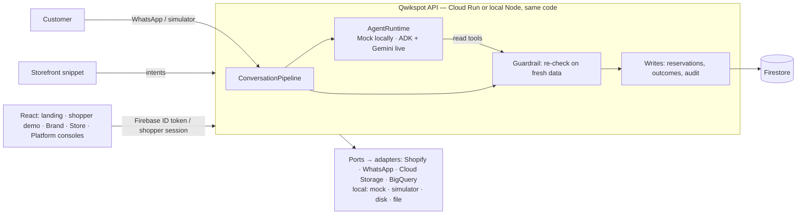

# Qwikspot

**AI that turns a shopper's "I need it today" into a sale at the nearest store that really has it — and shows the brand what happened.**

Qwikspot is an omnichannel commerce layer for D2C brands. It watches storefront intent (a product view, an abandoned cart, a "Need it today?" tap), continues the journey in a WhatsApp conversation, lets an AI agent pick the next best action from **verified** catalogue and store-stock data, reserves the product at an eligible nearby store, guides the store through the pickup, and records the outcome — online or in store — so the brand can see whether a weekday problem is demand or availability.

Every AI action is re-checked by a guardrail on fresh data before anything is written; the agent can never invent stock, choose a closed store or touch another customer's data.

## Try it in 10 minutes (local, synthetic data)

Requires **Node.js 24** and **Java 21+** (Firebase emulators). No Google Cloud account and no `.env` files.

```bash
npm install
cp backend/.env.example backend/.env   # turns on DEMO_MODE: demo logins on the login page + Reset demo
npm run emulators            # terminal 1: Auth + Firestore emulators
npm run seed:demo            # terminal 2: demo brand, stores, stock, users, 4 weeks of synthetic history
npm run dev:backend          # terminal 2: API on :8080
npm run dev:frontend         # terminal 3: http://localhost:5173
```

Open <http://localhost:5173>. Five surfaces, all on synthetic data:

| Surface | Where | Who it is for |
|---|---|---|
| **Landing** | `/` | Anyone: what Qwikspot does, Brand / Store login, "See it as a shopper" |
| **Shopper demo** | `/shop` (the brand's website with the Qwikspot widget) and `/chat` (the brand's WhatsApp chat) | A shopper — no login; each tab is its own synthetic shopper |
| **Brand Console** | `/brand` | The brand: results, conversations with their journey and "why", reservations, insights, network, settings |
| **Store Console** | `/store` | One store: today's holds (Next up), why each hold came, history, stock, demand near the store |
| **Platform Console** | `/platform` | The Qwikspot team: brands, the retail network and the audit — aggregates only, never a customer |

The login page lists every demo account under **Try the demo** (DEMO_MODE; it never widens what a role may do). Each browser tab keeps its own sign-in, so one window can hold every role.

| Account | Email | Opens |
|---|---|---|
| Brand Admin — Demo Beauty Co | `admin@demo-brand.test` | Brand Console |
| Retail Admin — Andheri Store | `retail-admin-north-2@qwikspot.test` | Store Console — the demo hold lands here |
| Retail Admin — Bandra Store | `retail-admin-north-1@qwikspot.test` | Store Console (Bandra only) |
| Platform Admin | `platform@qwikspot.test` | Platform Console |

Local demo password: `qwikspot-demo-1` (emulators only; a deployed demo uses its own secret).

### The 10-minute judge script

Start from a clean demo: **Brand Console → Overview → Demo guide → Reset demo** (it asks first; it resets the shared demo for everyone and removes every judge's chats and demo shoppers). Then:

| # | Where | Do | You should see |
|---|---|---|---|
| 1 | Landing | **See it as a shopper** | The brand's demo store |
| 2 | Shopper demo | **Vitamin C Glow Serum** → 30 ml → **Need it today? Check a store near you** → send | The brand's chat (docked on desktop, full screen on a phone) |
| 3 | Chat | **📍 → Near Powai**, then **Pick up today** | Powai is out of stock, so the card offers "Pick up today at Andheri Store, 7.6 km" next to "Home delivery in 4–5 days"; then the pickup pass, pickup code and the store's location |
| 4 | New tab: **Store login** (Andheri) | **Confirm → Mark ready → Customer arrived → Complete** with the code from the chat | Confirm and Mark ready appear in the shopper's chat, Complete sends one thank-you; "Why this hold came to you" on the card |
| 5 | **Brand login** → Conversations | Open the conversation | The journey from the website to "Picked up at Andheri Store — in-store purchase", and why Andheri was offered |
| 6 | Brand → Insights | — | The funnel, the weekday reading (an availability problem, not a demand problem), suggestions linked to the store |
| 7 | Shopper demo → **Demo controls** | **Sign in as Asha** → add the serum to the bag → leave; ~3 minutes later Brand → Conversations → **Process due work now** | The cart follow-up arrives in Asha's chat, with quick replies. Every "Sign in as Asha" is its own synthetic customer |
| 8 | **Platform login** | Overview → Retail network → System | Results across brands as counts, store health flags, and how Qwikspot runs today (Mock AI, simulator, mock catalogue) |

[docs/JUDGE_TEST_PLAN.md](docs/JUDGE_TEST_PLAN.md) is the longer hands-on test (stories a–h, privacy and phone checks); `node scripts/judge-test-plan.mjs` runs all of it in a browser and prints the results table. `node scripts/judge-script.mjs` runs exactly these steps through the UI — starting with Reset demo, at 1440 px and 390 px — and writes the screenshot set in [docs/screenshots/](docs/screenshots/README.md). `npm run demo:check` walks the core journey over HTTP and prints ✔ / ✘ per step (`BASE_URL` points it at a deployment).

Emulator data persists between runs in `.emulator-data/` (git-ignored; exported when you stop the emulators with Ctrl+C). Delete the folder to start from nothing.

## Connect a real Shopify store (local)

Optional — everything above works on the mock catalogue. This connects a brand to a real Shopify store (here the dev store **AquaSkin**, `m6ccxz-wk.myshopify.com`) through the Shopify app **Qwikspot** in the Dev Dashboard (scopes `read_products, read_inventory, read_customers, read_orders`).

1. **Start a tunnel to the backend.** In VS Code: **Ports** panel → **Forward a Port** → `8080` → right-click → **Port Visibility → Public**. Copy its `https://…devtunnels.ms` address (no trailing slash). Shopify must reach it for the OAuth callback and the webhooks.
2. **Point the Shopify app at it.** Dev Dashboard → Qwikspot → **Versions/Configuration**: set the redirect URL to `<tunnel>/api/integrations/shopify/callback`, then release the version.
3. **Add to `backend/.env`** (never commit it):
   ```bash
   COMMERCE_PROVIDER=shopify
   SHOPIFY_API_KEY=<the app's Client ID>
   SHOPIFY_API_SECRET=<the app's Client secret>
   PUBLIC_BACKEND_URL=https://<your-tunnel>.devtunnels.ms
   FRONTEND_URL=http://localhost:5173
   TOKEN_ENCRYPTION_KEY=<node -e "console.log(require('crypto').randomBytes(32).toString('base64'))">
   ```
   `SHOPIFY_API_VERSION` defaults to `2026-10` and `SHOPIFY_SCOPES` to the four scopes above. The backend refuses to start with a missing or invalid value and names it (never its value).
4. **Start** the emulators, the backend and the frontend as above. Seed first if you have not: `npm run seed:demo` syncs every brand's catalogue, so run it once **before** setting `COMMERCE_PROVIDER=shopify` (or with `COMMERCE_PROVIDER=mock npm run seed:demo`). The emulator data then persists.
5. **Connect.** Brand login → **Settings** → **Shopify** → enter `m6ccxz-wk.myshopify.com` → **Connect Shopify** → approve in Shopify. You land back on Settings with "Shopify connected"; Qwikspot stored the store's token encrypted on the server and registered the `orders/create` and `app/uninstalled` webhooks.
6. **Sync.** **Sync products**: the catalogue now comes from the store (its products replace the seeded mock catalogue, which is archived).
7. **Map the stock.** Brand → Overview → Demo guide → **Reset demo**. It keeps the Shopify connection, syncs from Shopify and re-imports the demo stores' stock, so every SKU — including the store's six new ones (micellar water, eye cream, lip balm, body lotion) — maps to the live products.

An order placed on the Shopify store with a `qs_ref` cart attribute (from a chat's "Buy online" link) is attributed to that conversation; other orders are recorded unattributed. **Disconnect** (or uninstalling the app in Shopify) deletes the stored token.

## How it is built



- **Ports and adapters:** the core never imports an adapter (tested); the `local` and `gcp` profiles differ only in which adapters `composition/container.ts` wires. The `gcp` profile refuses every mock/local adapter and checks all required settings at startup.
- **Multi-tenant by construction:** scope comes only from the verified token and the user record — never from a client-supplied `brand_id`. Retail Admins see exactly one store.
- **Safety:** the agent's writes run only after the guardrail; reservations change stock in one transaction; every mutating route is audited; logs carry IDs, never PII or message text.

Locally everything runs on the Firebase emulators with a mock commerce catalogue, a WhatsApp simulator (it renders only what WhatsApp can) and a deterministic mock agent (labelled "Mock AI · deterministic" — it verifies the pipeline, not AI quality). Shopify can be connected locally (above, L2-Shopify); Gemini and WhatsApp are wired in the live phases (L1–L2).

## Checks

```bash
npm run format:check && npm run typecheck && npm test   # unit + contract tests (backend + frontend)
npm run test:emulator                                    # end-to-end on the emulators (full journey, Reset demo, races)
npm run build && npm run secrets:scan                    # no secrets in the repo or the built bundle
npm run demo:check                                       # smoke-walk a running stack
```

## Repository and docs

```text
frontend/        React + TypeScript + Vite — landing, shopper demo (/shop, /chat), Brand · Store · Platform consoles
backend/         Node.js 24 + TypeScript + Express — domain / application / ports / adapters
infrastructure/  Firestore rules and indexes, Cloud Build, deploy scripts
docs/            The specification (00–11), the deployment runbook (12) and the screenshot set (docs/screenshots)
```

- What each surface shows, and its states: [docs/11_INTERFACE_CONTRACT.md](docs/11_INTERFACE_CONTRACT.md)
- Screenshots of the judge script (desktop and phone): [docs/screenshots/](docs/screenshots/README.md)
- Architecture, scaling and roadmap: [docs/03_TECH_ARCHITECTURE.md](docs/03_TECH_ARCHITECTURE.md)
- Deploying to Google Cloud: [docs/12_DEPLOYMENT_RUNBOOK.md](docs/12_DEPLOYMENT_RUNBOOK.md) and [infrastructure/README.md](infrastructure/README.md)
- Milestones and what each one taught: [docs/10_EXECUTION_PLAN.md](docs/10_EXECUTION_PLAN.md), [docs/09_LEARNING_LOG.md](docs/09_LEARNING_LOG.md)

Status: M1–M7 and the Interface Refresh (UI-0 – UI-6) complete on the local profile; L1–L3 (Google Cloud, real integrations, live verification) follow.

## Core loop

Digital intent → Context → AI decision → Conversational action → Online / retail purchase → Outcome → Brand intelligence

Built with React, TypeScript, Node.js, Firebase Auth, Firestore, Cloud Run, Google ADK, Gemini on Vertex AI, BigQuery (Looker optional).
