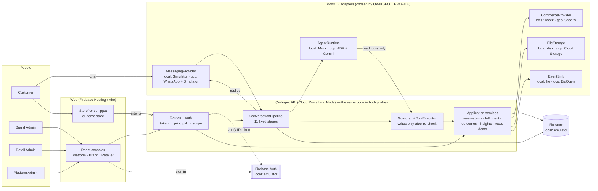

# Qwikspot — Technical Architecture

## Status

**M0 — Frozen target architecture.** Updated by the post-M0 architecture change (`00_M0_SPECIFICATION_FREEZE.md` §11.8): four interfaces, provider/adapter layering, local and GCP execution profiles.

The Google Cloud target architecture below is unchanged. The local profile runs the **same** logical architecture, with local adapters (§2.2).

---

# 1. Architecture principle

Qwikspot is a Google Cloud-native application with external commerce systems integrated through controlled backend services.

```text
Customer
  WhatsApp
     ↓
Qwikspot backend
     ↓
AI agent + commerce context
     ↓
Verified action
     ↓
Retailer / Shopify
```

---

# 2. High-level architecture

```
                              QWIKSPOT
                                  │
        ┌─────────────────┬───────┴─────────┬─────────────────────┐
        ↓                 ↓                 ↓                     ↓
  PLATFORM ADMIN     BRAND CONSOLE    RETAILER CONSOLE    CUSTOMER AI CHANNEL
     CONSOLE                                              WhatsApp (+ simulator)
        │                 │                 │             + contextual pages
        └─────────────────┴────────┬────────┴─────────────────────┘
                     React + TypeScript (one app)
                                   ↓
                       Firebase
                    Hosting + Auth
                            ↓
                        Cloud Run
                   Node.js + TypeScript
                         Express
                            │
          ┌─────────────────┼─────────────────┐
          ↓                 ↓                 ↓
      Firestore          ADK + Gemini    Business Rules
                            │
                       Vertex AI
                            │
       ┌────────────────────┼────────────────────┐
       ↓                    ↓                    ↓
    Shopify             WhatsApp             Retail
       │                    │                    │
       └────────────────────┼────────────────────┘
                            ↓
                       Qwikspot Context
                            ↓
                        Next Action
                            ↓
                       Outcome Events
                            ↓
                         BigQuery
                            ↓
                     Looker (optional)
```

The diagram shows the **GCP profile**. In the local profile, the same boxes are served by the local adapters (§2.2).

## 2.1 Layering (ports and adapters)

Qwikspot is **one** logical architecture. Business logic is written once and does not know which profile it runs in.

```text
backend/src/
  domain/        pure rules, no I/O: intent stage rules, reservation state machine,
                 action → outcome mapping, guardrail policies, store eligibility
  application/   use cases: ConversationPipeline, ReservationService, RetailImportService,
                 IntentService, OutcomeService, TenantAdminService, PlatformAdminService
  ports/         CommerceProvider, MessagingProvider, AgentRuntime,
                 FileStorageProvider, EventSink (+ repository interfaces)
  adapters/      commerce/{mock,shopify}  messaging/{simulator,whatsapp}
                 agent/{mock,adk-gemini}  storage/{local,gcs}  events/{local,bigquery}
                 firestore/ (repositories; same code in both profiles)
  http/          Express routes, auth middleware, request context, error envelope
  composition/   the only place that reads the profile and wires adapters
```

Rules:

- `domain/` and `application/` import only from `domain/` and `ports/`, never from `adapters/`.
- No business rule is duplicated between adapters. If two adapters would need the same rule, it belongs in `domain/` or `application/`.
- The existing M1 modules (`auth/`, `routes/`, `middleware/`) become part of `http/`. They are moved incrementally, not in one big rewrite.

## 2.2 Execution profiles

Two profiles run the same architecture. The sequencing is in `10_EXECUTION_PLAN.md`.

| Concern | `local` profile | `gcp` profile |
|---|---|---|
| Frontend hosting | Vite dev server | Firebase Hosting |
| API runtime | Node.js / Docker on the developer machine | Cloud Run |
| Authentication | Firebase Auth **Emulator** | Firebase Authentication |
| Database | Firestore **Emulator** | Firestore |
| Files | `LocalFileStorageProvider` | `GCSFileStorageProvider` (Cloud Storage) |
| Commerce | `MockCommerceProvider` | `ShopifyCommerceProvider` |
| Customer channel | `SimulatorMessagingProvider` | `WhatsAppMessagingProvider` + `SimulatorMessagingProvider` (fallback) |
| Agent runtime | `MockAgentRuntime` | `AdkGeminiAgentRuntime` (ADK + Gemini on Vertex AI) |
| Event export | `LocalEventSink` | `BigQueryEventSink` |
| Secrets | git-ignored `.env` files | Secret Manager, exposed to Cloud Run as env vars |
| BI | Brand Console views only | Brand Console views + Looker where required |

Firestore and Firebase Auth are **not** replaced locally by a different database or identity system. The emulators keep the production data model and auth chain identical.

Selection:

```text
QWIKSPOT_PROFILE   = local | gcp          (sets the defaults above)
COMMERCE_PROVIDER   = mock | shopify
MESSAGING_CHANNELS  = simulator | simulator,whatsapp | whatsapp
AGENT_RUNTIME       = mock | adk_gemini
FILE_STORAGE        = local | gcs
EVENT_SINK          = local | bigquery
```

Per-adapter overrides exist for isolated integration spikes (`10_EXECUTION_PLAN.md` §5). The main local milestone path uses the local adapters.

**Profile guard (startup):** the `gcp` profile refuses to start with `mock` commerce, `mock` agent runtime, `local` file storage, a `local` event sink, or Firebase emulator hosts (`07_SECURITY_SPEC.md` §19). The simulator channel is allowed in `gcp` as the approved fallback.

**Configuration contract (M7, Change 14 G7):** in `gcp` every required setting is checked together at startup (`GOOGLE_CLOUD_PROJECT`, `GCP_REGION`, `VERTEX_MODEL`, `VERTEX_LOCATION`, `WHATSAPP_ACCESS_TOKEN`, `WHATSAPP_PHONE_NUMBER_ID`, `WHATSAPP_APP_SECRET`, `WHATSAPP_VERIFY_TOKEN`, `SHOPIFY_SHOP_DOMAIN`, `SHOPIFY_ADMIN_TOKEN`, `SHOPIFY_WEBHOOK_SECRET`, `BIGQUERY_DATASET`, `GCS_BUCKET`, `DEMO_MODE`, `CORS_ALLOWED_ORIGINS`; `FIRESTORE_DATABASE` defaults to `(default)`). A missing one stops the service with one message that lists the names, never the values.

## 2.3 One core, two profiles (diagram)



The core never imports an adapter (enforced by `backend/test/architecture.test.ts`); only `composition/container.ts` chooses them. Moving from `local` to `gcp` is configuration plus the real adapters (L1/L2), never a change to the core.

---

# 3. Frontend

Technology:

**React + TypeScript + Vite**

One React application serves the three consoles and the customer contextual pages. Each console is a route area selected by the signed-in user's scope:

| Area | Interface | Scope |
|---|---|---|
| `/platform/*` | Platform Admin Console | `PLATFORM_ADMIN` |
| `/brand/*` | Brand Console (includes the customer simulator) | `BRAND_ADMIN` |
| `/retailer/*` | Retailer Console (one store) | `RETAIL_ADMIN` |
| `/nearby-stores`, `/reservation/:id`, `/pickup/:id` | Customer AI Channel contextual pages | page token, no login |

Responsibilities:

- the three consoles and the contextual task pages
- authentication UI
- connection setup
- conversation/operation views
- status and error states

Route areas are a UX convenience. Authorization is always enforced by the backend, whose API areas mirror them: `/api/platform/*` (platform scope), `/api/brand/*` and `/api/brands/:brandId` (brand scope), `/api/retail/*` (retail scope, own store only). The per-interface contract is `11_INTERFACE_CONTRACT.md`.

The customer does not receive a full Qwikspot dashboard.

# 4. Backend:

Technology:

- Node.js 24
- TypeScript
- Express

Agent:

- `AgentRuntime` port (§8). The GCP implementation is Google ADK for TypeScript + Gemini (`AdkGeminiAgentRuntime`); the local implementation is `MockAgentRuntime`.

---

# 5. Firebase

## Firebase Hosting

Hosts the web application.

## Firebase Authentication

Identity for console users:

- platform administrators (`PLATFORM_ADMIN`)
- brand administrators (`BRAND_ADMIN`)
- retail administrators (`RETAIL_ADMIN`)

Locally, the Firebase Auth Emulator provides the same identity flow.

Customer identity (WhatsApp or simulator) is handled through the customer channel-identity model (`04_DATA_MODEL.md` §6) rather than a Qwikspot customer portal.

---

# 6. Cloud Run

Cloud Run is the central backend runtime in the `gcp` profile. In the `local` profile, the same backend runs as a local Node.js process or container.

Responsibilities:

- API endpoints
- Shopify integration
- WhatsApp webhook handling
- retail-file processing orchestration
- customer context assembly
- AI orchestration
- authorization
- business rules
- reservation workflow
- audit events
- analytics event emission

Cloud Run is the service boundary between the web application, external services, data layer and AI layer.

Cloud Run instances are **stateless**. No conversation, session, token or rate-limit state that must survive a request may live only in instance memory (per-instance rate limiting in §16.4 is the one accepted MVP exception). Any instance must be able to handle any request.

Authenticated requests follow the Firebase ID token → Cloud Run → authorization chain defined in `07_SECURITY_SPEC.md` §4.1.

---

# 7. Firestore

Firestore is the operational application database.

Every persisted entity in `04_DATA_MODEL.md` has a collection. The authoritative path layout is `04_DATA_MODEL.md` §21.

Tenant-scoped (under `brands/{brand_id}/`):

```text
connections
customers
products
productVariants
productMappings
retailers
stores
retailInventory
retailImports
customerIntents
conversations
conversations/{conversation_id}/messages   (ConversationMessage)
aiRecommendations
reservations
outcomes
commerceEvents
auditEvents
```

Top-level (looked up before the brand is known, or platform-level):

```text
brands
users
intentTokens
pageAccessTokens
webhookReceipts
platformAuditEvents
```

Use tenant-aware document paths and server-side authorization.

**Client access rule (MVP):** React never reads or writes Firestore directly. All data access goes through Cloud Run using the Firebase Admin SDK. Firestore security rules deny all client reads and writes.

---

# 8. AI architecture

```text
Customer input
      ↓
Cloud Run
      ↓
Context builder
      ↓
AgentRuntime            (gcp: ADK + Gemini · local: MockAgentRuntime)
      ↓
Tool calls where required
      ↓
Structured decision (AgentDecision, 05 §8)
      ↓
Action guardrail
      ↓
Backend action
```

## 8.1 Agent execution model

The agent runtime runs **inside the backend request**. Each run is stateless and request-scoped. This holds for both runtimes.

```text
Inbound message (from ConversationPipeline, §8.2)
      ↓
Load conversation state from Firestore
(conversation, recent messages, current intent, prior recommendations)
      ↓
Build controlled context package
      ↓
AgentRuntime.decide()
  AdkGeminiAgentRuntime: create ADK runner + in-memory session for THIS request only
  MockAgentRuntime:      deterministic rules
      ↓
Tool calls via ToolExecutor (backend functions, guardrail enforced)
      ↓
Validate structured decision
      ↓
Persist to Firestore
(messages, AIRecommendation incl. runtime, CommerceEvents, audit, any executed action)
      ↓
Discard runner and session
```

Rules:

- Firestore is the only durable conversation state. The ADK in-memory session is rebuilt from Firestore on every request and thrown away when the request ends.
- No persistent ADK session service, background agent loop or long-lived agent process is used in the MVP.
- Agent tools are in-process backend functions. They call the same domain services as the HTTP API. They are not HTTP calls back into Cloud Run.
- Both customer channels (WhatsApp and the simulator) reach the agent only through the `ConversationPipeline` (§8.2).
- Inbound WhatsApp messages are processed synchronously within the webhook request, under the time budget in §16.1. A Meta redelivery that arrives while the first delivery is still processing is dropped by the webhook receipt (§16.3).
- MVP limitation: if a customer sends two messages in quick succession, each is processed in its own run against the Firestore state at run start. Strict per-conversation serialization is out of MVP scope.

## 8.2 ConversationPipeline (one pipeline for every customer channel)

There is exactly **one** conversation pipeline. Channel adapters only verify, normalize and transport messages.

```text
WhatsApp webhook ──► WhatsAppMessagingProvider.verifyInbound + normalizeInbound ─┐
                                                                                  ├─► ConversationPipeline.handleInbound(InboundMessage)
Simulator channel ─► SimulatorMessagingProvider.normalizeInbound ─────────────────┘
(POST /api/channels/simulator/messages)

ConversationPipeline.handleInbound:
  1. idempotency (webhookReceipts, §16.3)
  2. identity resolution: Customer by channel_identities (04 §6)
  3. intent handshake token detection/binding (06 §10.1)
  4. conversation state: create/update Conversation, persist inbound ConversationMessage
  5. policy: consent / opt-out / customer-service window / human-handoff state /
     per-conversation AI rate limit (07 §17)
  6. AgentRuntime.decide() with ToolExecutor (§8.1)
  7. guardrail: ALLOWED / BLOCKED / HUMAN_APPROVAL_REQUIRED
  8. execute allowed tools/actions (e.g. ReservationService)
  9. persist AIRecommendation (with runtime), CommerceEvents, AuditEvents; emit to EventSink
 10. outbound: MessagingProvider for the conversation's channel → send()
 11. outcome recording hooks (04 §16)
```

Messages that the backend sends outside an inbound request (e.g. "your pickup is ready" after a retailer transition) use the same policy step (5) and the same `send()` path.

The simulator is **not** a separate AI flow. It differs from WhatsApp only in its adapter.

---

# 9. External systems

## Shopify

Source of truth for online commerce. It is reached through `ShopifyCommerceProvider` (`gcp`); `MockCommerceProvider` stands in locally.

## WhatsApp Cloud API

Primary customer communication channel. It is reached through `WhatsAppMessagingProvider` (`gcp`); `SimulatorMessagingProvider` is the local channel and the approved fallback.

## Retail file

Source for physical store/inventory information in MVP, read through `FileStorageProvider`.

---

# 10. Data/analytics architecture

Operational:

```text
Firestore
```

Historical/event (exported through the `EventSink` port; `LocalEventSink` writes JSON Lines locally):

```text
BigQuery
```

Visualization:

```text
Looker (optional for the MVP)
```

The frontend may still display key metrics directly where needed.

Looker is an optional business-intelligence layer, not the primary customer/retailer application UI. The Brand Console must work without it.

---

# 11. File storage

Files are accessed only through the `FileStorageProvider` port (`06_INTEGRATION_CONTRACTS.md` §6a): Cloud Storage in `gcp`, a local data directory in `local`.

Stored files:

- retail uploads
- product assets
- store assets
- demo datasets
- generated reports where needed

Firestore stores metadata/references (e.g. `RetailImport.file_key`).

---

# 12. Secrets

Use:

**Google Secret Manager**

for:

- external API credentials
- access tokens
- webhook secrets
- application secrets

Never expose sensitive credentials to React.

---

# 13. Optional components

These are not required for the first working MVP:

```text
Pub/Sub
Vertex AI Search
Cloud SQL
AlloyDB
advanced Looker modeling
```

They may be introduced only when a concrete requirement justifies them.

---

# 14. Final responsibility split

This is the `gcp` profile. The local equivalents are in §2.2.

```text
React
→ experience: Platform Admin, Brand and Retailer consoles + customer contextual pages

Firebase
→ identity + hosting

Cloud Run
→ backend + orchestration + policies + the single ConversationPipeline

Firestore
→ current application state

ADK (via AgentRuntime)
→ agent orchestration

Gemini
→ reasoning + language + next-best action

Shopify
→ online commerce source

WhatsApp
→ customer channel

Retail data
→ physical commerce input

BigQuery
→ historical analytics

Looker
→ optional brand BI
```

---

# 15. Reservation transaction

Reservation creation **must** run inside a single Firestore transaction, so that concurrent reservations cannot overbook inventory.

```text
runTransaction:
  1. read reservations/{reservation_id}
       reservation_id is derived from idempotency_key.
       If it exists → return the existing reservation (idempotent replay).
  2. read stores/{store_id}
       require store_status = ACTIVE and reservation_available = true
  3. read retailInventory/{store_id + canonical_sku}
       available_quantity = quantity − reserved_quantity
       require available_quantity ≥ requested quantity
  4. read brand reservation_policy
       require reservations_enabled and quantity ≤ max_quantity_per_reservation
  5. write reservations/{reservation_id}  status = PENDING, expires_at
  6. update retailInventory: reserved_quantity += quantity
  7. write CommerceEvent RESERVATION_CREATED + AuditEvent
commit
```

Why this works: every reservation for the same store × SKU reads and writes the same `retailInventory` document. Firestore therefore serializes the competing transactions. The losing transaction retries, reads the updated `reserved_quantity` and fails the availability check.

If a check fails, nothing is written. The caller receives a verified, specific reason, such as `OUT_OF_STOCK`, `STORE_INACTIVE` or `RESERVATIONS_DISABLED`, and the AI explains it without inventing alternatives.

Every later status transition that changes inventory (CANCELLED, EXPIRED, COMPLETED) uses the same transaction pattern. The effects are listed in `04_DATA_MODEL.md` §15.

**Expiry:** a sweep marks reservations past `expires_at` (still PENDING, CONFIRMED or READY) as `EXPIRED`, releasing each one in its own transaction. The sweep is an internal backend endpoint, and the retailer console also triggers it when the reservation list loads. In `gcp` it is additionally invoked on a schedule. The scheduling mechanism is decided at cutover (`00_M0_SPECIFICATION_FREEZE.md` §11.7).

---

# 16. MVP reliability rules

These rules cover the MVP. The numbers are prototype defaults and may be tuned.

## 16.1 Agent runtime timeout

```text
per Gemini call timeout          10 s
total AI decision budget         20 s per inbound message (any channel)
```

If the budget is exhausted, the request stops calling the runtime and uses the deterministic fallback (§16.2). The same budget is enforced around `MockAgentRuntime`, so the timeout and fallback paths are testable locally.

## 16.2 Retry and fallback

| Dependency | Retry | On final failure |
|---|---|---|
| Gemini (timeout, 429, 5xx) | 1 retry with jittered backoff, only if the budget remains | Deterministic fallback |
| Gemini (invalid structured output) | 1 repair attempt with the validation error | Deterministic fallback |
| WhatsApp send (429, 5xx, network) | up to 2 retries with exponential backoff (250 ms, 1 s), same outbound request ID — implemented in M7 for every channel | Message marked `FAILED`; shown as "Not delivered" in the Brand Console |
| Firestore unavailable (gRPC UNAVAILABLE / DEADLINE_EXCEEDED) | the SDK's own retries | `503 SERVICE_UNAVAILABLE`, retryable, "Qwikspot can't reach its database right now. Please try again in a minute." (M7) |
| Shopify API (429, 5xx) | exponential backoff respecting Shopify throttling, up to 3 retries | Sync marked failed on the connection (`last_error`) |
| Firestore transaction contention | handled by the Firestore SDK transaction retry | Reservation request fails with a retryable error |
| 4xx validation / auth errors | never retried | Normalized error (`06_INTEGRATION_CONTRACTS.md` §16) |

**Deterministic fallback:** Qwikspot sends a fixed, safe holding reply. It never claims stock, price or policy. The AIRecommendation keeps the `runtime` that failed and is recorded with `action = HUMAN_HANDOFF` and `decision_source = DETERMINISTIC_FALLBACK` when human handoff is enabled for the brand. Otherwise it is recorded with `action = NO_ACTION` and a reply asking the customer to try again. The fallback never executes a commerce action.

## 16.3 Webhook idempotency

Every webhook is handled in this order:

```text
1. verify signature          (reject 401 on failure, nothing persisted)
2. derive idempotency key
3. create webhookReceipts/{key} with create-if-absent
       already exists → return 200, do nothing
4. process
5. mark receipt PROCESSED (or FAILED)
6. return 200
```

Idempotency keys:

| Source | Key |
|---|---|
| Shopify webhook | `SHOPIFY:{brand_id}:{event_type}:{X-Shopify-Webhook-Id}` |
| WhatsApp inbound message | `WHATSAPP:{phone_number_id}:MESSAGE:{wamid}` |
| WhatsApp status update | `WHATSAPP:{phone_number_id}:STATUS:{wamid}:{status}` |
| Simulator inbound message | `SIMULATOR:{brand_id}:MESSAGE:{client_message_id}` |
| Reservation request | client-supplied `idempotency_key` scoped to brand + customer (§15) |
| Analytics event | `CommerceEvent.idempotency_key` |

This follows the rule in `06_INTEGRATION_CONTRACTS.md` §8 (external_event_id + event_type + brand_id).

If processing fails after the receipt was created, the receipt is marked `FAILED` and the handler returns 5xx so that the provider redelivers. A redelivery that finds a `FAILED` receipt may process again. One that finds a `PROCESSING` or `PROCESSED` receipt is dropped.

## 16.4 Rate limiting and abuse protection

Defined in `07_SECURITY_SPEC.md` §17. In summary:

- per-IP and per-brand request limits on public endpoints (`POST /api/intents`, customer-page endpoints)
- per-conversation limits on AI decisions
- request body size limits on every endpoint
- a Cloud Run max-instances cap to bound cost under abuse

For the MVP, HTTP rate limiting may be in-memory per instance. The per-conversation AI limit is enforced through Firestore, because it must hold across instances.

---

# 17. Critical API contracts

The minimal request/response contracts for the critical endpoints are in `06_INTEGRATION_CONTRACTS.md` §14.1–§14.9.

---

# 18. Scaling & production (M7)

The MVP is sized for a judged demo and the first brands; nothing in the core has to change to go further.

| Concern | MVP (now) | Production path |
|---|---|---|
| API | Cloud Run, stateless, min 0 / max 5 instances (`deploy-backend.sh`), `asia-south1` | Raise max instances; min 1 for warm starts; one service per region |
| Database | Firestore Native; every brand under `brands/{brand_id}`; reservations in transactions | Same model; hot documents (a busy store's stock row) stay safe through transactions; composite indexes are checked by `indexCompleteness.test.ts` |
| HTTP rate limits | in-memory per instance (docs/07 §17 allows it) | Cloud Armor or a shared limiter (Memorystore) once there are many instances |
| AI cost | per-conversation limit in Firestore; 20 s budget; deterministic fallback | Per-brand monthly budget, model routing (small model first) |
| Webhooks | idempotent receipts (§16.3), replay waits for the first run | Pub/Sub between the webhook and the pipeline for bursts |
| Analytics | Firestore + `EventSink` → BigQuery (`gcp`) | BigQuery + Looker dashboards; the Outcomes screen stays the operational view |
| Files | Cloud Storage, signed uploads | Lifecycle rules; virus scan before import |
| Shared demo | one allowlisted demo brand, `judge_xxxx` customers, 20-min holds, "Reset demo" | Per-prospect sandbox brands created by the Platform Admin |
| Operations | `/api/health` with version/commit, structured logs without PII, `demo:check` smoke test | Uptime check on `/api/health`, log-based alerts on 5xx and `FAILED` deliveries, error budget |

**Roadmap after the MVP:** retrieval over product knowledge (Vertex AI Vector Search / RAG) for richer EDUCATE / COMPARE answers; Meta Embedded Signup so a brand connects its own WhatsApp number; a Shopify app install instead of a pasted admin token; POS adapters (a `RetailInventoryProvider` per POS) so store stock is live instead of file-based; per-prospect sandbox brands.
